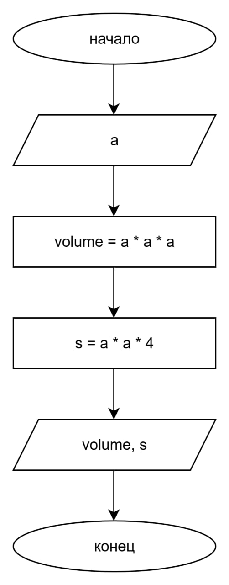

# Домашнее задание к работе 3

## Условие задачи
Написать и отладить программу вычисления объема куба и
площади его боковой поверхности по заданной длине ребра.

## 1. Алгоритм и блок-схема 

### Алгоритм
1. Объявить переменную 'a' - сторона длины ребра куба
2. Считать значение a
3. Объявить переменные:
   * 'volume' - объём куба
   * 's' - площадь боковой поверхности куба
5. Вычислить:
   * 'volume' = 'a' * 'a' * 'a'
   * 's' = 'a' * 'a' * 4
6. Вывести на экран значения объема куба и площади боковой поверхности куба
7. Конец

### Блок-схема

[Ссылка на draw.io](https://viewer.diagrams.net/?tags=%7B%7D&lightbox=1&highlight=0000ff&edit=_blank&layers=1&nav=1&title=%D0%94%D0%B8%D0%B0%D0%B3%D1%80%D0%B0%D0%BC%D0%BC%D0%B0%20%D0%B1%D0%B5%D0%B7%20%D0%BD%D0%B0%D0%B7%D0%B2%D0%B0%D0%BD%D0%B8%D1%8F.drawio&dark=auto#R%3Cmxfile%3E%3Cdiagram%20name%3D%22%D0%A1%D1%82%D1%80%D0%B0%D0%BD%D0%B8%D1%86%D0%B0%20%E2%80%94%201%22%20id%3D%22VTI-KGL9grpIBW5nIlkW%22%3E7Zhdk5MwFIZ%2FDTfO6PBderktVcfRcWd6obcZOAvRQDCEQv31hpJAIe1Uu1Z23L1Jkzcfp3lecvgwnHXWvGOoSD%2FRGIhhm3FjOKFh24HlirIV9p3gLYJOSBiOO8kahC3%2BCVI0pVrhGMrRQE4p4bgYixHNc4j4SEOM0Xo87IGScdQCJaAJ2wgRXf2CY57KbdmLQX8POElVZMtfdj0ZUoPlTsoUxbQ%2BkpyN4awZpbyrZc0aSMtOcenmvT3T2%2F8xBjn%2FnQnR1zDcfUi%2Fff6xJWn10Q%2FT781rucoOkUpu2AhNYxUeStMILSNYqLooV4dyIzfE94qSiCQMEY1VnWIO2wJFbU8tLgmhpTwjomWJqgwHjENzdh9WT0dcVUAz4GwvhsgJjgIqryhXNuvBHsuXWnpkjRqH5BWR9CsP0ERFcvsDhvZphneS1cDTO%2FD0nxa92fE5Oj4NUB7ftWdZtCKCyhJHYy6MVnkMbRCzpwSxdrAvMjpi4J1AoDQGBHG8Gy9%2FiouMcE%2BxCDxYsFy%2B8UYmBBO2Ja1YBHLa8ZG%2BuJJlT5biiCXAtaUOTvU7v94898U81%2Fxr7rnTQ3Zj9zzNPaTZJ25bRVsVDiBCgNCEoUwYVQDDIj6wad%2F90HEpnz3gBtQ9%2F0b5rT8Qs%2BU3X4O8o6TKwLDXLen%2FDbjjzw188ZKTeuCPz0n2NL3dOCcFZ4%2BLeWiaIkWZr8a%2FE3fH7v37Z6oe2WxHYKlBLM%2Fyc58ev2Bufurt8znnEI3uI3LI9AH3xjnEOvFa%2B9zsc6ZvAtfb50zvJlfbJ5rDB49u%2BPDVyNn8Ag%3D%3D%3C%2Fdiagram%3E%3C%2Fmxfile%3E)

## 2. Реализация программы 
#define _CRT_SECURE_NO_DEPRECATE 
#include <stdio.h>
#include <locale.h>

int main()
{
	int a;
	setlocale(LC_CTYPE, "RUS");
	puts("ВЫЧИСЛЕНИЕ ОБЪЁМА И ПЛОЩАДИ БОКОВОЙ ПОВЕРНОСТИ КУБА\n");
	puts("***************************************************\n\n");
	puts("Введите число:");
	scanf("%d", &a);
	puts("\n");
	int volume = a * a * a;
	int s = a * a * 4;
	printf("Объём куба равен %d см^3, площадь боковой поверхности куба равна %d см^2.\n\n", volume, s);
	return 0;
}

## 3. Результаты работы программы
ВЫЧИСЛЕНИЕ ОБЪЁМА И ПЛОЩАДИ БОКОВОЙ ПОВЕРНОСТИ КУБА

***************************************************

Введите число:
3

Объём куба равен 27 см^3, площадь боковой поверхности куба равна 36 см^2.

## 4. Информация о разработчике
Вильальба Агния, бТИИ-251
